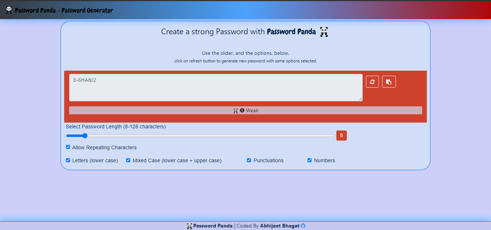

# passwordpanda
Password Genrerator 

An application that generates a random password based on user-selected criteria. This runs in the browser and feature dynamically updated HTML and CSS powered by JavaScript code. The app has a responsive clean and polished user interface, ensuring that it adapts to multiple screen sizes.

 <div align="center">
 
 </div>

# how it works

 * Password Panda gets your preferences for password through the checkboxes.
* **After every criteria selection** the  **password is generated immidiately.** 
* If the user wants to generate a new password for already selected criteria. The regenerate button is used.
* when Password Panda loads all checkboxes are selected by default and a password is already generated.


# Author and Deployment details
* Deployed : [Git Hub Pages](https://bhagatabhijeet.github.io/passwordpanda/index.html)
* Repository : [Git Hub](https://github.com/bhagatabhijeet/passwordpanda)
* Coded By : Abhijeet Bhagat([Git Hub Profile](https://github.com/bhagatabhijeet))

# Screen Shot
<div align="center">
Full Browser
 
 
## User Story

```
AS AN employee with access to sensitive data
I WANT to randomly generate a password that meets certain criteria
SO THAT I can create a strong password that provides greater security
```

## Acceptance Criteria

```
GIVEN I need a new, secure password
WHEN I click the button to generate a password
THEN I am presented with a series of prompts for password criteria
WHEN prompted for password criteria
THEN I select which criteria to include in the password
WHEN prompted for the length of the password
THEN I choose a length of at least 8 characters and no more than 128 characters
WHEN prompted for character types to include in the password
THEN I choose lowercase, uppercase, numeric, and/or special characters
WHEN I answer each prompt
THEN my input should be validated and at least one character type should be selected
WHEN all prompts are answered
THEN a password is generated that matches the selected criteria
WHEN the password is generated
THEN the password is either displayed in an alert or written to the page
```